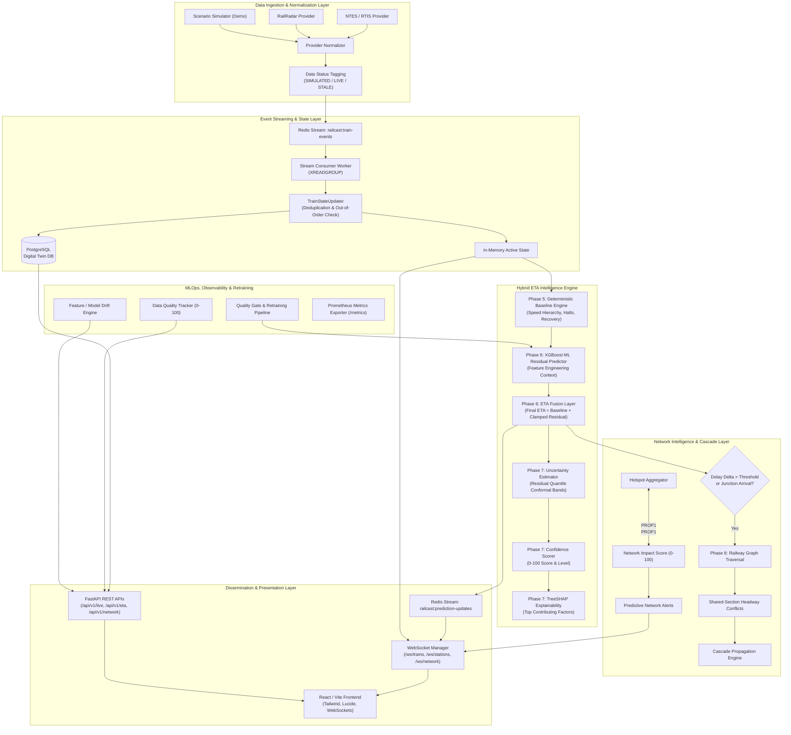
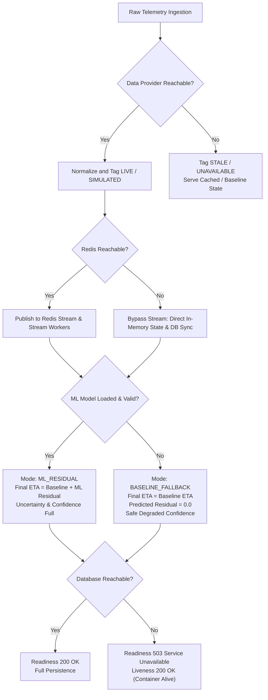

# RAILCAST Platform Architecture & System Design Document (Phases 1–11)

**System Name:** RAILCAST — Real-Time AI-Powered ETA & Railway Network Intelligence Platform  
**Target Domain:** Indian Railways Network & Real-Time Operational Intelligence  
**Version:** 1.11.0 (Phase 11 Consolidated Architecture)  

---

## 1. Executive Architecture Overview

RAILCAST is an event-driven, hybrid deterministic-statistical intelligence platform designed to ingest raw or simulated railway telemetry, maintain real-time spatial and operational train states, compute robust ETAs with calibrated uncertainty intervals and confidence scores, evaluate network-wide delay propagation and section conflicts, and broadcast live updates to operators and passenger interfaces via WebSockets and REST APIs.

### 1.1 Architectural Principles
1. **Deterministic Foundation:** Deterministic physics-based baseline ETA is the primary invariant. The ML layer never replaces the baseline; it predicts residuals. If the ML layer degrades or fails, the system automatically falls back to baseline ETA without service interruption.
2. **Absolute Data Status Honesty:** Every data point and API response carries explicit source and status metadata (`SIMULATED`, `LIVE`, `STALE`, `UNAVAILABLE`). The system never claims simulated data is live real-world telemetry.
3. **Event-Driven Continuous Processing:** Telemetry events flow through Redis Streams (`railcast:train-events`), updating in-memory operational states and triggering debounced recalculations.
4. **Predictive vs Operational Demarcation:** All network intelligence (conflicts, propagation, hotspots) is strictly classified as predictive advisory intelligence, never as automated dispatching or safety-critical signalling decisions.

---

## 2. End-to-End System Flow Architecture



---

## 3. Failure Modes & Degradation Hierarchy

The RAILCAST system enforces strict graceful degradation invariants across every layer:



### Invariant Summary Table

| Subsystem Failure | Impact on System | Fallback Behavior | User / Client Indication |
|:---|:---|:---|:---|
| **External Data Provider Down** | Live GPS updates pause | ProviderManager fails over to secondary adapter or marks `UNAVAILABLE` | `provider_status: UNAVAILABLE`, `data_age_seconds` ticks up |
| **Redis Cache / Stream Down** | Stream buffering & caching disabled | Services fall back to direct DB sync; ETA calculations execute synchronously | Health reports `status: DEGRADED`, `components.redis: DOWN` |
| **ML Model Failure / Corrupted** | ML residual unavailable | ETA engine falls back to pure deterministic baseline engine | `prediction_mode: BASELINE_FALLBACK`, `final_eta == baseline_eta` |
| **Out-of-Order Telemetry Arrival** | Delayed or re-sent event | State updater logs and commits historical event to DB, but rejects state advancement | Current operational state preserved at newest timestamp |
| **Duplicate Event Arrival** | Redundant message | SHA-256 fingerprint deduplication discards second event in <0.01 ms | Operational state unaltered |
| **PostgreSQL Database Down** | Data mutations pause | Kubernetes readiness probe returns 503; liveness probe returns 200 | HTTP 503 Service Unavailable, frontend shows offline banner |

---

## 4. Phase-by-Phase Module Directory Structure

```
D:\RAILCAST\
├── backend/
│   ├── app/
│   │   ├── api/                    # REST API routes & middleware (Phase 3, 5, 8, 10, 11)
│   │   │   ├── middleware/         # Correlation ID & Rate Limiting
│   │   │   └── routes/             # trains, stations, live, eta, network, system, websocket
│   │   ├── cache/                  # Redis connection pool & helpers (Phase 1, 9)
│   │   ├── core/                   # Configuration & security (Phase 1, 10, 11)
│   │   ├── db/                     # SQLAlchemy async engine & migrations (Phase 1, 2)
│   │   ├── ml/                     # ML Residual Engine & Explainability (Phase 6, 7, 10)
│   │   │   ├── features.py         # 13 railway feature engineering transformations
│   │   │   ├── predictor.py        # XGBoost residual inference & lazy loading
│   │   │   ├── registry.py         # Model catalog & atomic active_model.json pointer
│   │   │   ├── uncertainty.py      # Quantile-based residual interval estimation
│   │   │   └── explain.py          # TreeSHAP factor contribution calculation
│   │   ├── models/                 # SQLAlchemy digital twin domain entities (Phase 2)
│   │   ├── monitoring/             # Health, Data Quality, Drift & MLOps (Phase 10)
│   │   ├── network/                # Railway graph & delay cascade engine (Phase 8)
│   │   │   ├── graph.py            # Bounded spatial-temporal railway network graph
│   │   │   ├── conflict.py         # Shared-section headway conflict detector
│   │   │   ├── propagation.py      # Delay cascade propagation algorithm
│   │   │   └── impact.py           # 0-100 Network Impact scoring & hotspot aggregator
│   │   ├── providers/              # Real railway provider adapters & manager (Phase 4)
│   │   ├── repositories/           # Database access layer (Phase 2, 8, 10)
│   │   ├── schemas/                # Standardized Pydantic schemas (Phase 2, 3, 5-11)
│   │   ├── services/               # Core business services (Phase 3, 5, 6, 7)
│   │   │   ├── baseline_eta_service.py # Deterministic section-aware baseline engine
│   │   │   ├── eta_fusion_service.py   # Baseline + ML Residual fusion orchestrator
│   │   │   └── confidence_service.py   # Multi-factor confidence score engine
│   │   └── streaming/              # Event-driven real-time pipeline (Phase 9)
│   │       ├── consumer.py         # Redis Stream worker consumer group
│   │       ├── pipeline.py         # Continuous prediction orchestrator
│   │       ├── state.py            # Train state updater & dedup
│   │       └── websocket.py        # Multiplexed WebSocket manager
│   ├── docs/                       # Architectural & operational documentation
│   ├── scripts/                    # CLI scripts (seed, retrain, run_demo, benchmark)
│   └── tests/                      # 275+ automated pytest tests
└── src/                            # React 19 + TypeScript + Tailwind CSS Frontend
    ├── lib/                        # api.ts (client contracts) & websocket.ts (real-time hook)
    ├── pages/                      # Operations, Intelligence & System dashboard pages
    └── components/                 # Reusable UI widgets, badges, cards, and navigation
```

---

## 5. Standardized API Synonym Contract (Phase 11)

All endpoints across Phase 1–10 adhere to unified synonym fields preserving 100% backward compatibility:

| Standard Field | Canonical Meaning | Synonyms / Aliases Supported | Target Endpoints |
|:---|:---|:---|:---|
| `scheduled_eta` | Timetable scheduled arrival | `scheduled_arrival` | `/api/v1/eta/*` |
| `baseline_eta` | Deterministic baseline ETA | `baseline_eta` | `/api/v1/eta/*` |
| `ml_residual_minutes`| Clamped ML correction in minutes | `predicted_residual_minutes` | `/api/v1/eta/*` |
| `final_eta` | Fused prediction | `final_eta` | `/api/v1/eta/*` |
| `lower_bound` | Lower uncertainty interval (80%) | `uncertainty.lower_eta` | `/api/v1/eta/*` |
| `upper_bound` | Upper uncertainty interval (80%) | `uncertainty.upper_eta` | `/api/v1/eta/*` |
| `confidence_score` | Calibrated confidence (0–100) | `confidence.score` | `/api/v1/eta/*` |
| `confidence_level` | Categorical confidence level | `confidence.level` (`HIGH`, `MEDIUM`, `LOW`, `FALLBACK`) | `/api/v1/eta/*` |
| `status` / `provider_status` | Honesty data classification | `data_status`, `data_source` | `/api/v1/live/*`, `/api/v1/eta/*` |
| `data_age_seconds` | Elapsed seconds since telemetry retrieval | `data_age_seconds` | `/api/v1/live/*`, `/api/v1/eta/*` |
| `prediction_timestamp`| Generation timestamp of prediction | `generated_at` | `/api/v1/eta/*` |
